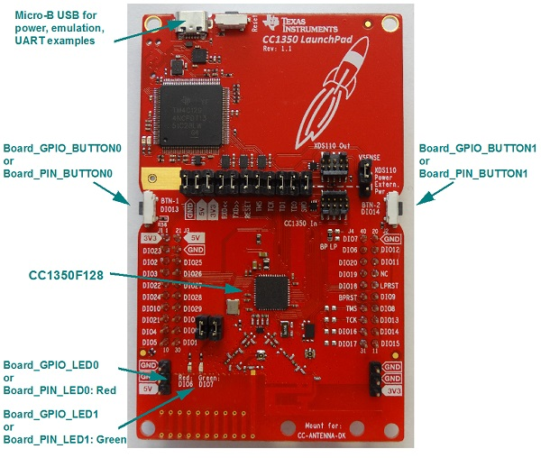

# CC1350 SimpleLink LaunchPad Settings & Resources

The CC1350 LaunchPad consists of a LaunchPad board with a CC1350EM
(CC1350F128 device).

## Jumper Settings

* For any examples that use LEDs, make sure the LED’s jumper settings are closed.

## Board resources used in driver examples:

The following table lists the Board names of the resources used by
the driver examples, and their corresponding pins.  Note that there may be
other resources configured in the board files that are not used by any
driver example.  Only the example resources are listed in the table.

  |Board Resource|Pin|
  |--------------|:---|
  |`Board_ADC0`|DIO23|
  |`Board_ADC1`|DIO24|
  |`Board_GPIO_BUTTON0`|DIO13|
  |`Board_GPIO_BUTTON1`|DIO14|
  |`Board_GPIO_LED0`|DIO6  (Red - must be jumpered)|
  |`Board_GPIO_LED1`|DIO7  (Green - must be jumpered)|
  |`Board_I2C_TMP`|DIO4, DIO5|
  |`Board_PIN_LED0`|DIO6  (Red - must be jumpered)|
  |`Board_PIN_LED1`|DIO7  (Green - must be jumpered)|
  |`Board_PIN_LED2`|DIO6  (Red - must be jumpered)|
  |`Board_PIN_BUTTON0`|DIO13|
  |`Board_PIN_BUTTON1`|DIO14|
  |`Board_PWM0`|DIO6|
  |`Board_PWM1`|DIO7|
  |`Board_SPI0`|DIO8, DIO9, DIO10|
  |`Board_UART0`|DIO2, DIO3|

## Booster packs

The following examples require booster packs.

  |Example|Booster Pack|
  |-------|:------------|
  |display|[430BOOST-SHARP96 Card BoosterPack](http://www.ti.com/tool/430boost-sharp96)|
  |i2ctmp007|[BOOSTXL-SENSORS Sensors BoosterPack](http://www.ti.com/tool/boostxl-sensors)|
  |portable|[BOOSTXL-SENSORS Sensors BoosterPack](http://www.ti.com/tool/boostxl-sensors)|

## ADC example pin connections

The ADC examples sample input from the `Board_ADC0` and `Board_ADC1` pins.  These pins should
be connected to the analog input. For quick testing, the `Board_ADC0` pin can be
connected to `GND` and `Board_ADC1` to `GND`.

  |ADC Pin (Function)||Analog Input|
  |------------------|-|:-----------|
  |Board_ADC0|-->|GND|
  |Board_ADC1|-->|GND|

>__Important:__ Caution should be used when connecting the pins to analog inputs greater than 3VDC.

## Peripherals Used

The following list shows which CC1350_LAUNCHXL peripherals are used by
driver and k ernel applications. Driver examples control which peripherals (and which ports) are used.

* __TI-RTOS Kernel (SYS/BIOS)__
    * Uses the CC13xx’s RTC timer and that timer's associated interrupts. The TI-RTOS Kernel manages the Interrupt Vector Table.
* __TI-RTOS Drivers__
    * __ADC:__ A CC13xx/CC26xx specific driver that uses the onboard ADC peripheral.
    * __Crypto:__ A CC13xx/CC26xx specific driver that uses the onboard AES Crypto processor.
    * __GPIO:__ The GPIO driver is used in various examples to drive `BOARD_GPIO_LED0`, and to monitor the `BOARD_GPIO_BUTTON0` and `BOARD_GPIO_BUTTON1` buttons.
    * __I2C:__ The I2C driver is used to manage the`Board_I2C0` I2C instance.
    * __PIN:__ A CC13xx/CC26xx specific driver PIN driver that uses 2 output pins for the onboard `BOARD_PIN_LED0` and `BOARD_PIN_LED1` and 2 input pins for buttons `Board_PIN_BUTTON0` and `Board_PIN_BUTTON1`.
    * __RF:__ The RF driver uses the on-chip radio module on CC13xx devices.
    * __SPI:__ The SPI driver uses SPI0 for `Board_SPI0` SPI instance.
    * __UART:__ The UART driver uses UART0, which is attached to the onboard emulator to facilitate serial communications.
    * __Watchdog:__ The Watchdog driver example uses the Watchdog Timer WDT peripheral (`Board_WATCHDOG0`).
