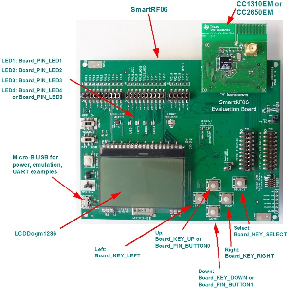

# CC2650DK_4XS Settings and Resources

The CC2650DK_4XS board is comprised of a CC2650EM-4XS board mounted on a SmartRF06EB Evaluation Board.

## Jumper Settings

* Install jumper J5 (labeled "Enable UART over XDS100v3", on the lower right side of the SmartRF06EB) to enable UART communications via the onboard USB debug connection.

## Board resources used in driver examples

The following table lists the Board names of the resources used by
the driver examples, and their corresponding pins.  Note that there may be
other resources configured in the board files that are not used by any
driver example.  Only the example resources are listed in the table.

  |Board Resource|Pin|
  |--------------|:---|
  |`Board_3V3_EN`|RF1.15 (LV_3.3V_EN)|
  |`Board_ADC0`|Internal comparator, VDDS|
  |`Board_ADC1`|RF2.5 (LV_ALS_OUT)|
  |`Board_ADCBUF0`|RF2.5 (LV_ALS_OUT)|
  |`Board_ALS_PWR`|RF2.6 (LV_ALS_PWR)|
  |`Board_GPIO_BUTTON0`|RF1.10 (LV_BTN_UP)|
  |`Board_GPIO_BUTTON1`|RF1.12 (LV_BTN_DOWN)|
  |`Board_GPIO_LED0`|RF1.4  (LV_LED_4, red-orange LED)|
  |`Board_GPIO_LED1`|RF1.2  (LV_LED_3, green LED)|
  |`Board_KEY_DOWN`|RF1.12 (LV_BTN_DOWN)|
  |`Board_PIN_BUTTON0`|RF1.10 (LV_BTN_UP)|
  |`Board_PIN_BUTTON1`|RF1.12 (LV_BTN_DOWN)|
  |`Board_PIN_LED0`|RF1.4  (LV_LED_4, red-orange LED)|
  |`Board_PIN_LED1`|RF1.2  (LV_LED_3, green LED)|
  |`Board_PIN_LED2`|RF1.4  (LV_LED_4, red-orange LED)|
  |`Board_PIN_LED3`|RF1.2  (LV_LED_3, green LED)|
  |`Board_PIN_LED4`|RF1.4  (LV_LED_4, red-orange LED)|
  |`Board_PWM_0`|RF1.2  (LV_LED_3, green LED)|
  |`Board_PWM_1`|RF1.4  (LV_LED_4, red-orange LED)|
  |`Board_UART0`|RF1.7, RF1.9 (UART routed thru emulation connection)|

## ADC examples pin connections

The ADC examples sample the output of the Ambient Light Sensor (ALS) mounted on the SmartRF06EB.  This signal is routed via EM pin RF2.5 (LV_ALS_OUT).

## Peripherals Used

The following list shows which CC2650DK_4XS peripherals are used by
driver and kernel examples. Driver examples control which peripherals (and which ports) are used.

* __Drivers.__
    * __Display:__ The Display driver uses both UART0 and the LCD display mounted on the SmartRF06EB.
    * __PIN:__ The PIN driver is used for sensing inputs and driving outputs on device pins.
    * __PWM:__ The PWM driver uses LED1 and LED2 mounted on the SmartRF06EB.
    * __UART:__ The UART driver uses UART0, which is connected to the debug host via the emulation connection.
    * __Watchdog:__ The Watchdog driver example uses the Watchdog Timer peripheral.
